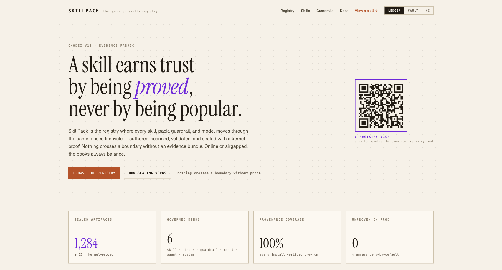
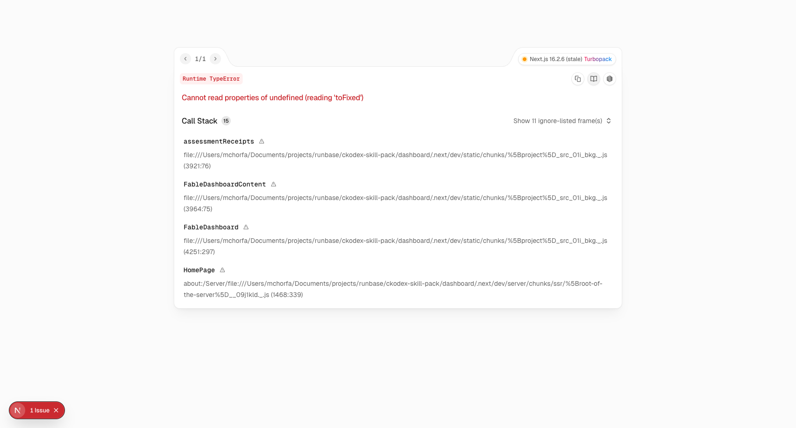
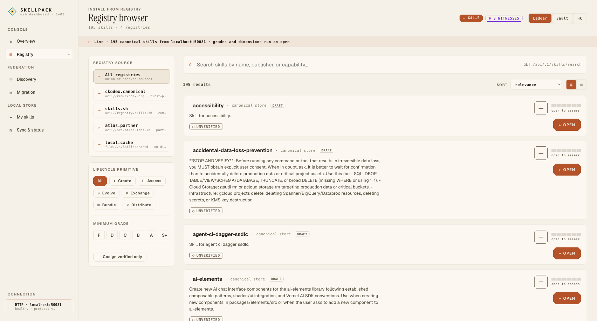
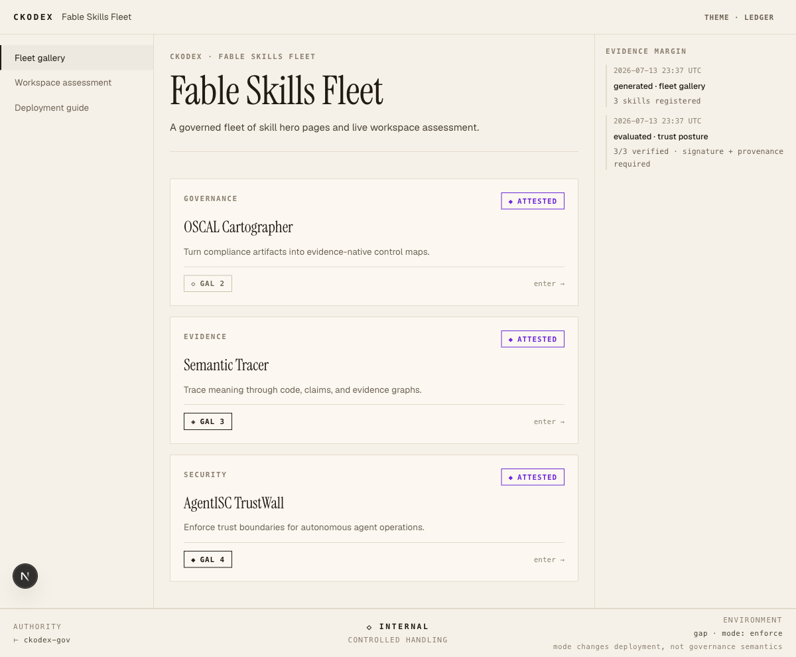
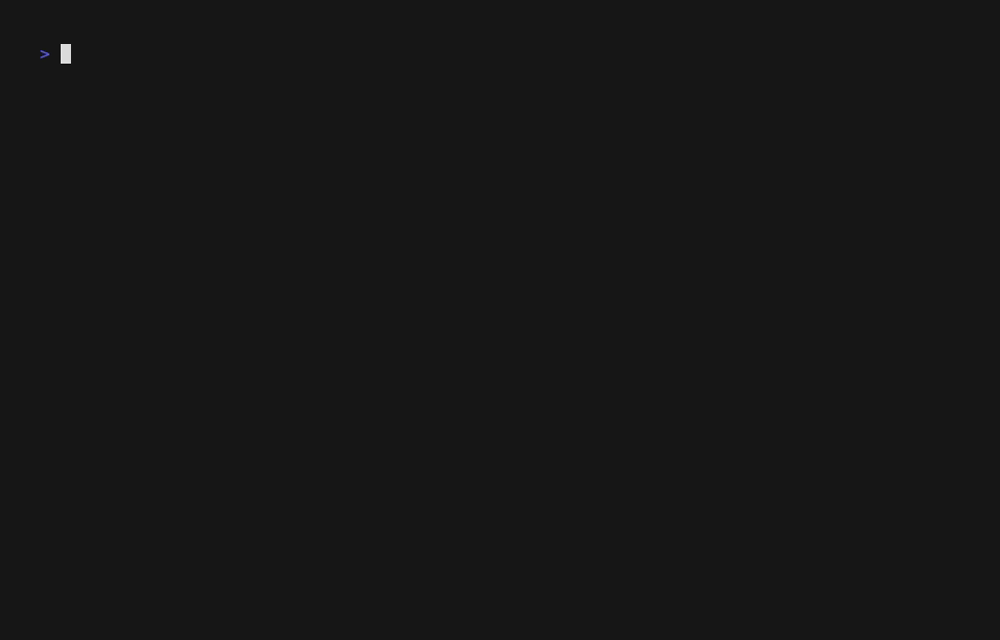

<div align="center">

# SkillPack

[](KNOWN-ISSUES.md)
[](CHANGELOG.md)
[](LICENSE)
[](rust-toolchain.toml)

**Quality grading for AI agent skills — the SonarQube of the skills ecosystem.**

Assess, grade, and publish AI agent skill packs with an evidence-backed **S+ → F** letter grade across nine quality dimensions — provenance-tracked, OCI-distributable, signature-verifiable.



Real grade badge emitted by `skillpack report --format badge` from the `known-a` test fixture — every skill can ship one next to its README:


</div>

## Why SkillPack

The agent-skills ecosystem has thousands of skills in circulation — and no standard way to answer *"is this one any good?"* SkillPack grades any skill pack across nine weighted dimensions — Security, Identity & Manifest, Provenance, Documentation, Testing, Compatibility, Lifecycle, Governance, and Evals/HITL — and issues a letter grade with the evidence behind every point.

- **Grade anything, in seconds.** `skillpack check` runs the full rubric; `skillpack grade` gives the one-letter answer for gates and CI.
- **Publish with a supply chain.** Push graded skills to any OCI registry (ORAS-compatible), with SBOM generation, SLSA provenance, and cosign signing wired into the pipeline.
- **Wire it into your agents.** gRPC + HTTP APIs, an MCP server for direct agent integration, and a VS Code extension for inline diagnostics.

## Quick start

```bash
# Install the CLI
cargo install --path . --bin skillpack

# Scaffold a new skill from a template
skillpack init my-skill --template mcp

# Run the full quality assessment
cd my-skill && skillpack check

# Just the letter grade (exits non-zero if below minimum — CI-friendly)
skillpack grade . --minimum B
```

## What you get

`skillpack check` produces a multi-dimensional assessment; `skillpack report` renders it as JSON, SARIF, Markdown, or a shareable SVG badge:



Every point of the grade is traceable: checkers emit per-dimension scores, findings are classified by severity, and optional evidence envelopes can be signed (keyless cosign) and archived for the audit trail.

## Feature tour

| Surface | What it does |
| --- | --- |
| **Grade system** | S+/S/A/B/C/D/F with configurable thresholds and dimension weights |
| **9 assessment dimensions** | Security, Identity & Manifest, Provenance, Documentation, Testing, Compatibility, Lifecycle, Governance, Evals & HITL |
| **Reports** | JSON, SARIF, Markdown, and SVG grade badges — all from one assessment |
| **OCI distribution** | `publish`/`install` to ORAS-compatible registries (tar.gz/bz2/br/zst/zip packaging) |
| **gRPC + HTTP APIs** | Registry-integration service with bearer-token auth, rate-limit-ready CORS, and body-size limits |
| **MCP server** | Integrates as a tool provider for AI agents (assess/grade/report/closest-match) |
| **VS Code extension** | Inline quality diagnostics, AI assistant, skill-creation wizard, registry browser |
| **Canonical store** | Multi-agent skill sync (`store sync/migrate/status`) with IP boundary checks |

<details>
<summary>Full CLI command reference</summary>

| Command | Description |
| --- | --- |
| `skillpack check [path]` | Run full quality assessment |
| `skillpack grade [path]` | Show letter grade only |
| `skillpack report [path]` | Generate JSON/SARIF/Markdown/badge report |
| `skillpack validate <file>` | Validate schema (CNSB/CNAAB/Evidence/Policy) |
| `skillpack init <name>` | Scaffold new skill project |
| `skillpack package [path]` | Create archive (tar.gz/bz2/br/zst/zip) |
| `skillpack publish [path]` | Push skill to OCI registry |
| `skillpack install <ref>` | Pull skill from OCI registry |
| `skillpack eval [path]` | Run evaluation suites (smoke/compliance) |
| `skillpack discover [path]` | Discover skills in directory |
| `skillpack lock [path]` | Generate skill.lock with integrity hashes |
| `skillpack migrate [path]` | Migrate manifest to latest schema version |
| `skillpack store sync` | Sync agent directories with canonical store |
| `skillpack store migrate` | Migrate physical skills to canonical store |
| `skillpack store status` | Show canonical store health & agent status |
| `skillpack store check-boundary <path>` | Check IP boundary violations |

</details>

## Registry and dashboard

The registry browser gives a catalog over published skills with grades surfaced at a glance:





## Trust and supply chain

SkillPack is built for the audience it grades: security-conscious skill authors and fleet operators.

- **Evidence-bearing grading.** Every assessment can be exported as a signed evidence envelope (keyless cosign); the Dagger pipeline performs real `cosign sign-blob`, CycloneDX SBOM generation, and SLSA provenance.
- **Governed codebase.** Hard limits enforced by the `xtask` CI gate: 500 LOC per file, zero clippy warnings (`-D warnings`), full test suite on every change, and skill paths validated against traversal at every entry point (gRPC, HTTP, MCP, canonical joins).
- **Honest about gaps.** Current limitations — including stub checkers, test-coverage gaps, and auth posture — are tracked openly in [KNOWN-ISSUES.md](KNOWN-ISSUES.md), and readiness evidence lives in [evidence/ALPHA-READINESS.md](evidence/ALPHA-READINESS.md) and [BETA-READINESS notes](docs/assessment-calibration-notes.md).

This is a **private beta**: suitable for trusted local/private evaluation today, with the above gaps documented rather than hidden.

## Documentation

- [Authoring guide](docs/authoring-guide.md) — how to write a skill that grades well
- [Assessment dimensions](docs/dimensions/) — the rubric in depth
- [OCI distribution](docs/oci-distribution.md) — publishing and installing via registries
- [Registry onboarding](docs/registry-onboarding.md) — joining the catalog
- [Agentic authoring patterns](docs/agentic-authoring-patterns.md) — for agent-assisted skill development

## Demo



The 15-second terminal demo is generated from a script with [vhs](https://github.com/charmbracelet/vhs) — demo-as-code, re-runnable in CI:

```bash
vhs docs/assets/demo.tape   # renders docs/assets/demo.gif
```

## Development

```bash
# Build all crates
cargo build

# Full CI-parity gate (fmt, clippy -D warnings, tests, smoke) — what release-tag runs
cargo run -p xtask -- ci

# Start the gRPC + HTTP servers
cargo run --bin skillpack-server
```

The workspace uses `~/.cache/cargo-target` as a shared `CARGO_TARGET_DIR` (see `.cargo/config.toml`) — build artifacts do not land in `./target`.

## License

Apache-2.0 — see [LICENSE](LICENSE).
