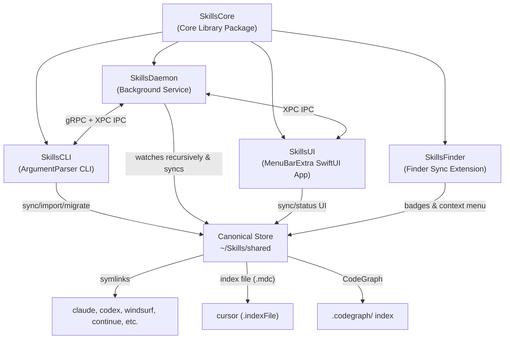

# Skills Ecosystem

A macOS-native Swift system designed to centralize coding agent skills (`SKILL.md` directories) into **one canonical store**, then securely distribute them to **12 AI coding assistants** via symlinks or structured index files. The ecosystem enforces rigorous Intellectual Property (IP) boundary protections (such as restricting Thales/private proprietary code patterns) across all layers: CLI, Daemon, Finder Extension, and Menu Bar App.

---

## 🏗️ Architecture & Modules

The system is composed of five distinct modules, built with Swift 6.2 on macOS 13+:



### 1. `SkillsCore`
The core logic library containing:
- **`SyncManager`**: Orchestrates skill discovery, manifest generation, symlink propagation, and CodeGraph synchronization.
- **`IPGuard`**: Boundary guard scanning paths and skill names for restricted patterns (`thales`, `cortaix-csr`, `ppt-thales`, `ip-pending`) using pre-compiled regular expressions.
- **`AgentConfig`**: Defines paths, override env variables, and integration types (`.symlink` or `.indexFile`) for each supported coding assistant.

### 2. `SkillsCLI`
A command-line interface (`skills-cli`) enabling developers to manually synchronize agent environments, import standalone skills, audit untracked skills, and trigger migrations.

### 3. `SkillsDaemon`
A persistent background service (`skills-daemon`) registered via `launchd`. It utilizes `FSEventStream` for recursive folder monitoring to trigger auto-synchronization when canonical skills change, and exposes both **gRPC** and native **XPC** interfaces for local state inspection.

### 4. `SkillsUI`
A modern macOS Menu Bar Extra application built with SwiftUI, allowing developers to see synchronization status, view recent sync history, and trigger manual syncs directly from the menu bar.

### 5. `SkillsFinder`
A macOS Finder Sync extension that shows status badges (green for synchronized/safe, red for IP boundary violations) directly in the Finder and adds a custom context menu for quick syncing and folder promotion.

---

## 🤖 Supported Agent Integrations

| Agent                    | Default Directory           | Integration Type      | Environment Override  |
| ------------------------ | --------------------------- | --------------------- | --------------------- |
| **Claude**               | `~/.claude/skills`          | `.symlink`            | `CLAUDE_SKILLS_DIR`   |
| **Cursor**               | `~/.cursor/rules`           | `.indexFile` (`.mdc`) | `CURSOR_RULES_DIR`    |
| **Windsurf**             | `~/.windsurf/skills`        | `.symlink`            | `WINDSURF_SKILLS_DIR` |
| **Continue**             | `~/.continue/skills`        | `.symlink`            | `CONTINUE_SKILLS_DIR` |
| **Aider**                | `~/.aider/skills`           | `.symlink`            | `AIDER_SKILLS_DIR`    |
| **Cline**                | `~/.cline/skills`           | `.symlink`            | `CLINE_SKILLS_DIR`    |
| **Roo Code**             | `~/.roo/skills`             | `.symlink`            | `ROO_SKILLS_DIR`      |
| **OpenCode**             | `~/.config/opencode/skills` | `.symlink`            | `OPENCODE_SKILLS_DIR` |
| **Codex**                | `~/.codex/skills`           | `.symlink`            | `CODEX_SKILLS_DIR`    |
| **Gemini / Antigravity** | `~/.gemini/config/skills`   | `.symlink`            | `GEMINI_SKILLS_DIR`   |
| **GitHub Copilot**       | `~/.github/copilot/skills`  | `.symlink`            | `COPILOT_SKILLS_DIR`  |
| **Augment**              | `~/.augment/skills`         | `.symlink`            | `AUGMENT_SKILLS_DIR`  |

---

## ⚙️ Prerequisites

- **macOS 13.0+** (Ventura or later)
- **Swift 6.2+** (included in recent Xcode command line tools)
- **XcodeGen** (optional, to generate `.xcodeproj` for `SkillsUI` and `SkillsFinderSync`)
  ```bash
  brew install xcodegen
  ```
- **CodeGraph CLI** (optional, to refresh indexing of synchronized skills)

---

## 🚀 Quick Start

### 1. Build and Run the Verification Sandbox
To verify the build and see the ecosystem in action inside a localized environment, run the provided sandbox script:
```bash
./run-demo.sh
```

### 2. Manual Installation
You can build and install the command-line utility and background daemon using the provided `Makefile`:

```bash
# Build all Swift Packages
make build

# Install skills-cli to /usr/local/bin
make install-cli

# Install skills-daemon to /usr/local/bin and load launchd plist
make install-daemon
```

---

## 🛠️ CLI Usage

`skills-cli` provides full parity with the `asm` (agent-skill-manager) command set,
operating natively in Swift against the local filesystem — no server required.

```bash
skills-cli <subcommand> [options]
```

### Core commands

```bash
# List all discovered skills across all providers
skills-cli list

# List as JSON, filtered to a specific provider, sorted by version
skills-cli list --json --tool claude --sort version

# Search skills by name, description, or tool
skills-cli search cloudflare

# Show full details for a skill
skills-cli inspect accessibility

# Install from GitHub (owner/repo) or local path
skills-cli install owner/repo
skills-cli install ./my-local-skill

# Remove a skill (prompts for confirmation)
skills-cli uninstall my-skill

# Disable/enable without uninstalling
skills-cli disable my-skill
skills-cli enable my-skill

# Scaffold a new skill
skills-cli init my-new-skill
```

### Audit & quality

```bash
# Detect duplicate skills across providers
skills-cli audit

# Run a security pattern scan on a skill
skills-cli audit security my-skill

# Evaluate a skill against best-practice rubric (score + grade)
skills-cli eval ./path/to/skill

# Show aggregate metrics dashboard
skills-cli stats
```

### Import / Export / Link

```bash
# Export full inventory as JSON manifest
skills-cli export --output inventory.json

# Import from a previously exported manifest
skills-cli import inventory.json

# Symlink a local skill into all enabled provider directories
skills-cli link ./my-skill
```

### Lifecycle

```bash
# Check which installed skills have newer commits available
skills-cli outdated

# Update outdated skills (re-audit security, replace atomically)
skills-cli update

# Validate and prepare submission to registry
skills-cli publish ./my-skill
```

### Bundles & index

```bash
# Create, list, show, install, remove bundles
skills-cli bundle create my-bundle --skills skill-a,skill-b
skills-cli bundle list
skills-cli bundle install my-bundle

# Build and search a local skill index
skills-cli index ingest
skills-cli index search "cloudflare workers"
```

### Environment & config

```bash
# Run environment health checks
skills-cli doctor

# Show / edit / reset config
skills-cli config show
skills-cli config path
skills-cli config reset
skills-cli config edit

# Legacy canonical-store sync (backward compat)
skills-cli sync --dry-run
skills-cli sync --migrate-all
```

### Global flags

| Flag            | Description                                              |
| --------------- | -------------------------------------------------------- |
| `--json`        | Output as JSON                                           |
| `--machine`     | Stable machine-readable JSON envelope (v1)               |
| `--no-color`    | Disable ANSI colors                                      |
| `-s, --scope`   | Filter: `global`, `project`, or `both` (default: `both`) |
| `-p, --tool`    | Filter by provider name                                  |
| `--sort`        | Sort by: `name`, `version`, or `location`                |
| `--flat`        | Show one row per tool instance                           |
| `-y, --yes`     | Skip confirmation prompts                                |
| `-V, --verbose` | Show debug output                                        |

---

## 🛡️ IP Boundary Protection (`IPGuard`)

Safety is built in at the core. The system blocks paths or folder names containing restricted patterns:
- `thales`
- `cortaix-csr`
- `ppt-thales`
- `ip-pending`

If a skill directory contains any of these files or match directories, or if the skill name violates these rules, the system immediately **fails closed**, skipping synchronization and logging an IP boundary violation.

---

## 🧪 Development & Testing

Run the unit tests from the workspace root:
```bash
cd SkillsCore && swift test
```
